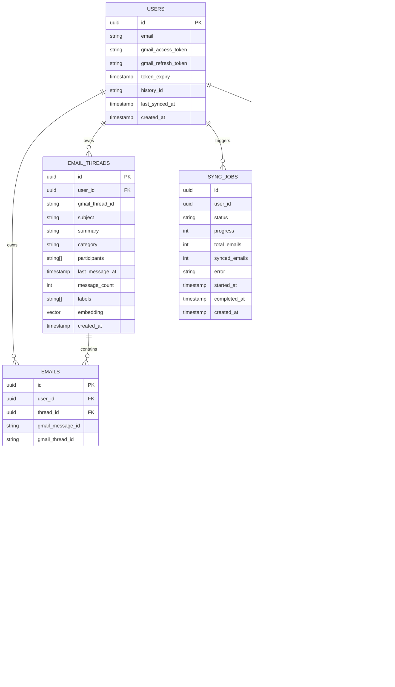

# AI-Powered Gmail Intelligence Platform
## Architecture & Design Document

This document outlines the high-level system architecture, design decisions, database schemas, and AI workflow integrations for the **Gmail Intelligence Platform**.

---

## 1. System Architecture

The application is structured as a full-stack Next.js web application utilizing React Server Components, Client Components, secure Route Handlers, and a Supabase database.

```
                  +----------------------------------------------+
                  |           Next.js 16 (React 19 UI)           |
                  |  Login UI (NextAuth.js Google OAuth)         |
                  |  Dashboard (Inbox Categories & Summaries)    |
                  |  RAG Chat Agent Panel & Compose Modals       |
                  +----------------------+-----------------------+
                                         |
                                         v HTTP / API
                  +----------------------+-----------------------+
                  |       Next.js API Route Handlers (Backend)   |
                  |  /api/gmail/sync  |  /api/chat  |  /api/send |
                  +-----------+--------------+--------------+----+
                              |              |              |
         +--------------------+              |              +--------------------+
         v OAuth Calls                       v Queries / RPC                     v API Calls
+------------------+                +--------+---------+                +------------------+
|    Gmail API     |                |   Supabase DB    |                |   AI Services    |
| (google-api-sdk) |                | (PostgreSQL with |                | - Gemini 2.5     |
| Syncs/sends mail |                |    pgvector)     |                |   Flash (LLM)    |
| and updates      |                | RLS enforced.    |                | - Gemini Embed-2 |
| message state    |                | Stores mail state|                | - NVIDIA NIM     |
|                  |                | & chat history   |                |   (Llama 3.1 8B) |
+------------------+                +------------------+                +------------------+
```

---

## 2. Core Technology Stack

| Component | Technology | Role & Justification |
| :--- | :--- | :--- |
| **Framework** | **Next.js 16.2 & React 19** | Full-stack architecture using App Router, enabling secure API Route Handlers and performant Server Components. |
| **Auth** | **NextAuth.js v5 (Auth.js)** | Manages Google OAuth 2.0 integration, secure JWT cookie session storage, and offline access/refresh token rotation. |
| **Database** | **Supabase (PostgreSQL)** | Persistent storage of parsed email structure, chat histories, sync states, and strict Row-Level Security (RLS) enforcement. |
| **Vector Search**| **pgvector extension** | Enables vector similarity search using Cosine distance indices directly in PostgreSQL, avoiding separate vector DB overhead. |
| **Primary LLM** | **Google Gemini 2.5 Flash** | Core engine for email/thread summarization, smart compose, and RAG. High context window, fast speed, and strong JSON generation. |
| **Embeddings** | **Gemini Embedding 2** | Generates 768-dimensional document and query embeddings tailored for contextual similarity search. |
| **Classifier** | **NVIDIA NIM (Llama 3.1 8B)** | Handles low-latency, single-word text classification to categorize incoming emails (Finance, Personal, Work, etc.). |
| **Styling** | **TailwindCSS 4.0** | Custom styling, glassmorphic dark mode, dashboard UI components, and micro-animations. |

---

## 3. Database Schema

The database schemas are designed for granular email tracking and vector search queries. Row-Level Security (RLS) ensures that users can only query/edit their own data via `user_id = auth.uid()`.



### Key Optimizations & Indexes
1. **Vector Indexes**: Inverted File Flat (`ivfflat`) indexes using `vector_cosine_ops` enable sub-millisecond similarity search queries over the `emails.embedding` and `email_threads.embedding` fields.
2. **Composite Indexes**:
   - `emails(user_id, sent_at DESC)` for instant dashboard chronologies.
   - `email_threads(user_id, last_message_at DESC)` for active inbox listing.
3. **Database Rules**: A PostgreSQL function `match_emails` acts as an RPC endpoint for vector calculation, taking query embeddings and returning sorted results based on cosine distance.

---

## 4. Key Pipelines & Implementation

### 4.1 Gmail Sync Pipeline (Rate-Limit Tolerant)
- **Execution Flow**: Calls `/api/gmail/sync`. Uses standard pagination to import the initial batch (up to 500 emails). For subsequent syncing, it fetches changes using the Gmail History API (`history_id`) to conserve bandwidth and API quota.
- **Resilience**: Employs an exponential backoff wrapper (`withRetry`) with randomized jitter to handle Gmail API rate limits (HTTP `429` / `403`) and temporary server errors (HTTP `5xx`):
  $$\text{Delay} = \min(\text{100ms} \times 2^{\text{attempt}} + \text{jitter}, \text{32000ms})$$
- **Concurrency**: Message metadata and bodies are fetched concurrently in batches of 10 to balance performance and rate-limit boundaries.

### 4.2 AI Categorization & Summarization
- **Email Categorization**: Offloads text classification from Gemini to a lower-cost, low-latency NVIDIA NIM (Llama 3.1 8B Instruct) deployment. It runs a single-word prompt categorization classifying messages into `Newsletter`, `Job/Recruitment`, `Finance`, `Notifications`, `Personal`, `Work/Professional`, or `Uncategorized`.
- **Per-Email Summarization**: The Gemini 2.5 Flash model produces 2-3 sentence summaries capturing core action items.
- **Thread Summarization**: Combines the conversation chronology into a single context window, producing a 3-5 sentence synthesis outlining unresolved items, decisions made, and follow-up duties.

### 4.3 RAG (Retrieval-Augmented Generation) Chat Agent
- **Hybrid Search Strategy**:
  1. **Semantic Search**: Embeds user query with Gemini Embedding 2 and queries `match_emails` in Supabase to return the top-K relevant emails.
  2. **Keyword Search**: Uses PostgreSQL `websearch_to_tsquery` to match exact spelling keywords and technical identifiers.
  3. **Merging**: Unifies and deduplicates matches, prioritizing high-scoring semantic records.
- **Grounding and Attribution**: Pass relevant message blocks as strict context prompts. The model is constrained to only answer queries using context emails and outputs structured citations mapping to database records, enabling source-card render in the chat interface.

### 4.4 Smart Compose & Thread Preservation
- **Smart Compose**: Interprets natural language user instructions to compose formatted drafts containing `{ to, subject, body }`.
- **Threaded Replies**: Analyzes thread history and user notes to draft replies. Injecting headers like `In-Reply-To` and `References` during sending keeps message chains intact under the parent thread inside Google Mail.

---

## 5. Security & Privacy

1. **Token Isolation**: Users' OAuth credentials (access/refresh tokens) are securely cached in the database. Access tokens are used locally and are automatically refreshed using authorization flow.
2. **Access Control**: Database connection routes employ Supabase authenticated JWT cookies, securing operations on a per-user basis.
3. **Data Protection**: Zero mail content is stored on intermediate models or hosts. AI operations (summaries, categorization, RAG) are handled using private, encrypted API endpoints via official Gemini and NVIDIA NIM integration libraries.
