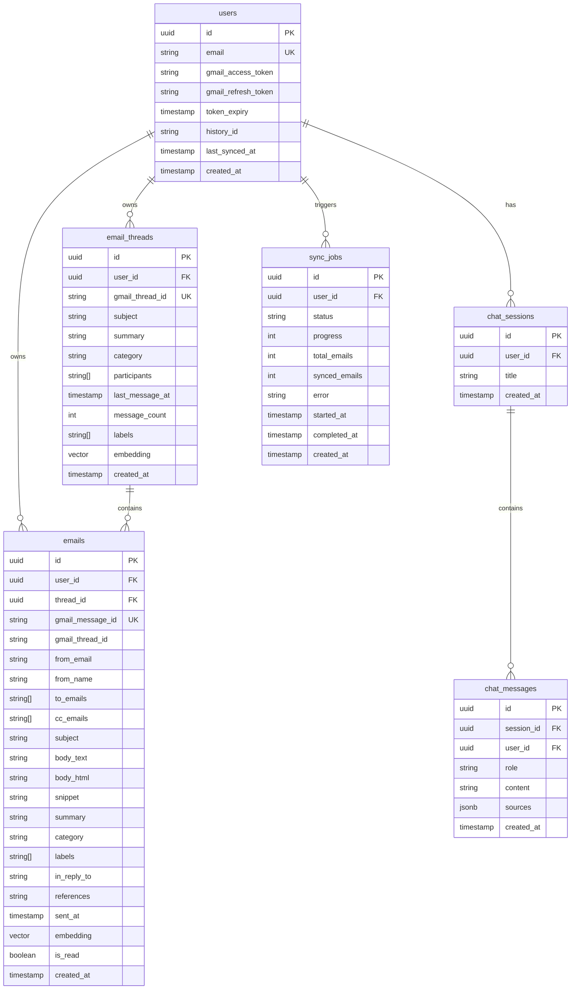

# AI-Powered Gmail Intelligence Platform
## Architecture & Design Document

This document outlines the technical architecture, design decisions, database schemas, and AI integrations for the **Gmail Intelligence Platform**.

---

## 1. System Architecture Overview

The application is built as a monorepos (Frontend + API Routes) using Next.js 16 (React 19), leveraging server-side actions, route handlers, NextAuth.js for OAuth 2.0 authentication, and Supabase (PostgreSQL with `pgvector`) for storing email data, chat sessions, and vector embeddings.

```
+-----------------------------------------------------------------------+
|                       Next.js App (React 19 Client)                   |
|  +--------------+  +---------------+  +------------+  +------------+  |
|  |   Login UI   |  |   Inbox UI    |  |  RAG Chat  |  | Compose/   |  |
|  | (OAuth Sign) |  | (Categorized) |  |   Agent    |  | Reply Mod  |  |
|  +-------+------+  +-------+-------+  +-----+------+  +-----+------+  |
+----------|-----------------|----------------|---------------|---------+
           |                 |                |               |
           v                 v                v               v
+-----------------------------------------------------------------------+
|                         Next.js API Route Handlers                    |
|   /api/auth     /api/gmail/sync      /api/emails    /api/chat         |
|   /api/compose  /api/reply           /api/send      /api/threads/[id] |
+----------+-----------------+----------------+---------------+---------+
           |                 |                |               |
           v                 v                v               v
+------------------+ +------------------+ +-----------------------------+
|    Gmail API     | |  Supabase DB     | |         AI Services         |
|  (OAuth Scopes:  | |  - PostgreSQL    | | - Gemini 1.5 Flash (LLM)    |
|   readonly,      | |  - pgvector RAG  | | - Gemini text-embedding-004 |
|   modify, send)  | |  - RLS Policies  | | - NVIDIA NIM Llama 3.1 8B   |
+------------------+ +------------------+ +-----------------------------+
```

---

## 2. Technology Stack & Justification

| Layer | Technology | Rationale |
| :--- | :--- | :--- |
| **Framework** | **Next.js 16 (App Router)** | Full-stack capability (Server Components, API Routes), built-in routing, and streamlined deployment. |
| **Auth** | **NextAuth.js v5 (Auth.js)** | Direct integration with Google OAuth 2.0, secure JWT session management, offline access token refreshing. |
| **Database** | **Supabase (PostgreSQL)** | Structured schema control, robust SDK, Row-Level Security (RLS), and native `pgvector` support for embedding search. |
| **Vector Search**| **pgvector** | Integrates vector similarity search (`<=>` cosine similarity) directly in PostgreSQL, avoiding external vector DB overhead. |
| **Primary LLM** | **Google Gemini 1.5 Flash** | 1-million-token context window (crucial for long email threads), fast inference, structured JSON output, and strong summarization capabilities. |
| **Categorization**| **NVIDIA NIM (Llama 3.1 8B)**| Fast, low-latency, and cost-effective text classification. Offloads simple classification tasks from Gemini. |
| **Embeddings** | **Gemini text-embedding-004**| 768-dimensional native embeddings with deep understanding of contextual details in email text. |
| **Styling** | **TailwindCSS & Lucide Icons**| Ultra-modern, premium dark-mode dashboard styling with glassmorphism effects and micro-animations. |

---

## 3. Database Schema Design

The database schema is designed to store synced email data, user credentials, chat histories, and sync logs while keeping security enforced using Postgres Row Level Security (RLS) policies.



### Key Schema Operations & Optimizations
1. **Vector Indexes**: `emails` and `email_threads` embeddings use `ivfflat` (cosine operators) to allow sub-millisecond retrieval of semantic matches.
2. **Composite Indexes**:
   - `emails(user_id, sent_at DESC)` ensures instantaneous email listings.
   - `email_threads(user_id, last_message_at DESC)` powers the sidebar/inbox dashboard.
   - `emails(gmail_message_id)` is a unique index to enforce message deduplication.
3. **Row-Level Security (RLS)**: RLS is active on all tables. A policy `USING (user_id = auth.uid())` prevents users from querying or editing other users' emails or chat history.

---

## 4. Key AI Workflows & Implementation

### 4.1 Gmail Sync Pipeline (Rate-Limit Tolerant)
1. **Trigger**: `/api/gmail/sync` starts the sync process. If a `history_id` exists, it triggers an incremental sync using the Gmail History API; otherwise, it performs an initial full sync.
2. **Rate Limiting**: Integrated exponential backoff wrapper (`withRetry`) checks for status code `429` (rate limits) and `5xx` errors. It retries requests up to 7 times with randomized delay:
   $$delay = \min(100 \times 2^{attempt} + \text{jitter}, 32000)\text{ ms}$$
3. **Concurrency**: Fetches message bodies concurrently in batches (10 concurrent requests at a time) to maximize throughput while respecting the API rate limits.
4. **Synchronization**: Deduplicates incoming messages using the database's unique constraints and updates `history_id` upon successful completion.

### 4.2 Email Categorization (NVIDIA NIM Llama 3.1 8B)
- **Role**: Offloads classification tasks from Gemini. It categorizes emails into: `Newsletter`, `Job/Recruitment`, `Finance`, `Notifications`, `Personal`, `Work/Professional`, or `Uncategorized`.
- **System Prompt**: Enforces strict single-word classification based on defined category characteristics:
  - *Finance*: Invoices, receipts, OTP financial statements.
  - *Job/Recruitment*: HR letters, interviews, offers.
  - *Newsletter*: Digests, promotional marketing, blog articles.
- **Batching**: Categorizes batch messages during sync concurrently.

### 4.3 Email & Thread Summarization (Gemini 1.5 Flash)
- **Email Summaries**: Compiles key takeaways and actionable items in 2-3 sentences.
- **Thread Summaries**: Concatenates individual messages in ascending order. Long threads are truncated or chunked to fit Gemini's context window. The model synthesizes the entire conversation history, highlighting unresolved threads, decisions made, and follow-ups.

### 4.4 RAG (Retrieval-Augmented Generation) Chat Agent
- **Retrieval**:
  1. Embeds the user's question via `gemini-text-embedding-004`.
  2. Runs a semantic similarity cosine distance function (`match_emails` SQL RPC call) in Supabase to extract the top-K relevant emails.
  3. Complements this with full-text keyword queries (`BM25` hybrid search) to prevent missing technical terms.
- **Grounding & Citations**:
  - The context is structured with headers (`From`, `Subject`, `Date`, `Similarity`).
  - The system prompt instructs Gemini to only output statements grounded in the email context and reject out-of-context answers ("I don't have information about that in your emails").
  - The response returns structured citations mapped to database entries to render source cards in the UI.

### 4.5 Email Smart Compose & Threaded Replies
- **Compose**: Analyzes user-described intents and maps them to a structured JSON containing `{ to, subject, body }`.
- **Replies**: Extracts full historical context of the thread. Incorporates the user prompt to draft a response that maintains context, style, and tone.
- **Thread Preservation**: Returns appropriate headers (`In-Reply-To` and `References`) to ensure the Gmail thread remains intact when delivered.

---

## 5. Security & Compliance

1. **Tokens**: Users' Google OAuth refresh tokens are stored securely in Supabase. Access tokens are used locally in api calls and automatically renewed via Google Auth endpoints when expired.
2. **Access Control**: Users are authenticated using JWTs, mapping directly to Supabase authenticated users via custom NextAuth sessions.
3. **Data Privacy**: No email contents are stored on intermediate systems. Summaries and embeddings are computed directly using Gemini/NVIDIA API endpoints.
